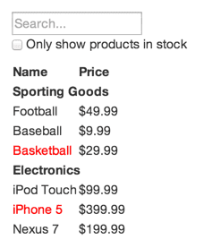
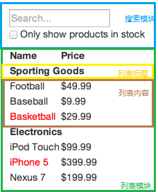

## reactDemo案例

### 设计稿



### 服务端数据

```js
let data =
[{category: "Sporting Goods", price: "$49.99", stocked: true, name: "Football"},
 {category: "Sporting Goods", price: "$9.99", stocked: true, name: "Baseball"},
 {category: "Sporting Goods", price: "$29.99", stocked: false, name: "Basketball"},
 {category: "Electronics", price: "$99.99", stocked: true, name: "iPod Touch"},
 {category: "Electronics", price: "$399.99", stocked: false, name: "iPhone 5"},
 {category: "Electronics", price: "$199.99", stocked: true, name: "Nexus 7"}];
```

### 组件划分




> 五个组件模块及嵌套关系确定

+ 产品查询
    + 搜索模块
    + 列表模块
        + 列表标题
        + 列表list

> 大项目推荐自下而上编写组件，小型项目自上而下编写组件 (state组件为有状态组件，props组件为无状态组件)

### 数据流分析

**产品查询数据**
+ 包含所有产品的原始列表数据
+ 用户输入的搜索词
+ 复选框是否选中
+ 经过筛选后的列表数据

**判断是否属于state**

+ 该数据是否由父组件通过props传递而来
+ 该数据是否随时间的推移而保持不变(若是，则应该不是state)
+ 能否根据其它state或props计算出数据(若是，则不是state)

**props数据**
+ 包含所有产品的原始列表数据
+ 经过筛选后的列表数据

**state数据**

+ 用户输入的搜索词
+ 复选框是否选中

